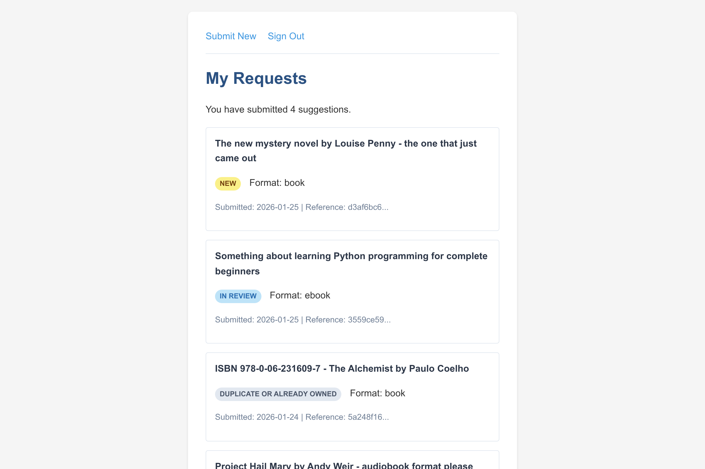
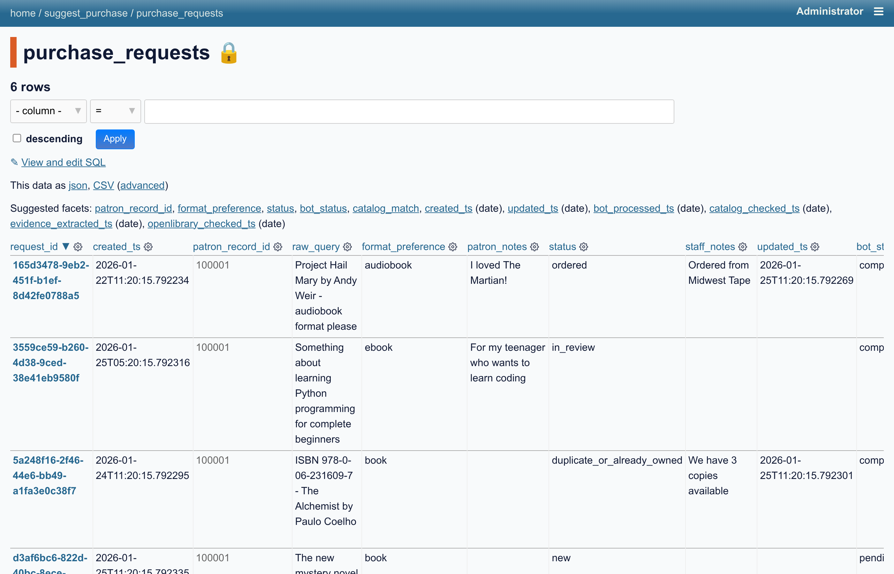
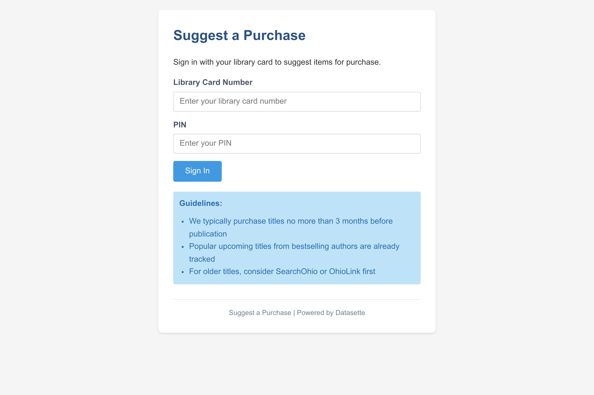
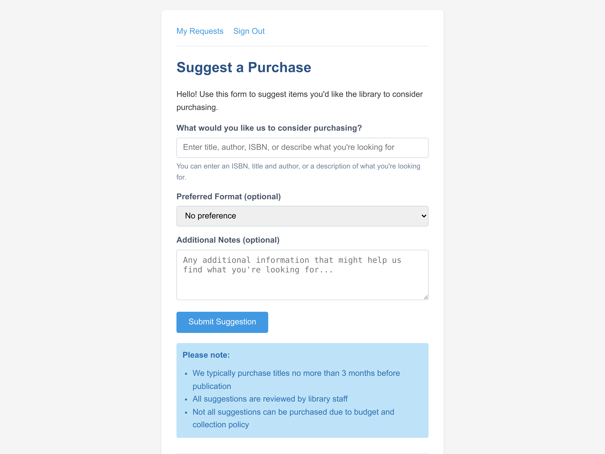

# datasette-suggest-purchase

A Datasette plugin that allows library patrons to suggest purchases, with Sierra ILS integration for patron authentication.

**Status:** POC complete + suggest-a-bot M1-M3 (321 tests passing)

## Screenshots

<table>
<tr>
<td width="50%">

**Customer View: My Requests**

Customers track their suggestions and see status updates in real-time.

</td>
<td width="50%">

**Staff View: All Requests**

Staff review requests with automated research from the suggest-a-bot.

</td>
</tr>
<tr>
<td>



</td>
<td>



</td>
</tr>
</table>

<details>
<summary>More screenshots</summary>

| Customer Login | Submission Form |
| -------------- | --------------- |
|  |  |

</details>

## Quick Start

### Option 1: Native Development

```bash
# Install dependencies
uv sync --dev && uv pip install -e .

# Start development server (initializes DB, starts fake Sierra, runs Datasette)
./scripts/dev.sh
```

### Option 2: Container Development (Podman)

```bash
# Build and start containers
./scripts/container-dev.sh --build

# Or just start (if already built)
./scripts/container-dev.sh

# View logs
./scripts/container-dev.sh logs

# Stop containers
./scripts/container-dev.sh down
```

Then open:
- **Patron UI:** http://127.0.0.1:8001/suggest-purchase
- **Staff login:** http://127.0.0.1:8001/suggest-purchase/staff-login
- **Staff view:** http://127.0.0.1:8001/suggest_purchase/purchase_requests

### Test Accounts

**Patrons** (Sierra/library card login):

| Barcode        | PIN  | Name            |
|----------------|------|-----------------|
| 12345678901234 | 1234 | Test Patron One |
| 23456789012345 | 5678 | Test Patron Two |

**Staff** (local account, set via environment):

```bash
# Set before starting the server
export STAFF_ADMIN_PASSWORD=yourpassword

# Optional customization
export STAFF_ADMIN_USERNAME=admin      # default: admin
export STAFF_ADMIN_DISPLAY_NAME=Admin  # default: Administrator
```

The admin account is automatically created/updated on startup when `STAFF_ADMIN_PASSWORD` is set.

## Features

### Patron
- Login with library card + PIN (Sierra ILS authentication)
- Submit purchase suggestion (free text + optional format/notes)
- View confirmation
- View "My Requests" with status updates

### Staff
- View all requests in Datasette table UI
- Update request status and add notes
- CSV export via Datasette
- Full audit trail via `request_events` table

### suggest-a-bot (Background Processor)

Automated background processor that enriches patron suggestions:

```bash
# Process all pending requests once
python -m suggest_a_bot --db suggest_purchase.db --once

# Dry run (show what would be processed)
python -m suggest_a_bot --db suggest_purchase.db --dry-run

# Run as daemon
python -m suggest_a_bot --db suggest_purchase.db --daemon
```

**Processing pipeline:**
0. **Evidence extraction** ✅ - Extract ISBN/ISSN/DOI/URLs, build structured evidence packet
1. **Catalog lookup** ✅ - Check Sierra for existing holdings (duplicate detection)
2. **Open Library enrichment** ✅ - Enrich with authoritative metadata when not in catalog
3. **Consortium check** - Query OhioLINK/SearchOHIO for availability (deferred)
4. **Input refinement** - Use LLM to normalize patron input
5. **Selection guidance** - Generate staff-facing assessment
6. **Automatic actions** - Place holds, flag duplicates (configurable)

See `llore/04_suggest-a-bot-design.md` for full design.

## Project Structure

```
src/datasette_suggest_purchase/
    plugin.py               # Main plugin with routes
    templates/              # Jinja2 templates
    migrations/             # SQL migrations

src/suggest_a_bot/          # Background processor (M1-M3 complete)
    config.py               # YAML config loading
    models.py               # Data models + DB operations
    pipeline.py             # Processing stages
    identifiers.py          # ISBN/ISSN/DOI/URL extraction
    evidence.py             # Evidence packet builder
    catalog.py              # Sierra catalog search + CandidateSets
    openlibrary.py          # Open Library API client + enrichment
    run.py                  # CLI entry point

scripts/
    dev.sh                  # Native dev startup
    container-dev.sh        # Container dev startup (podman-compose)
    init_db.py              # Database initialization + migrations
    fake_sierra.py          # Fake Sierra API for local dev

containers/
    datasette/Containerfile # Datasette + plugin image
    fake-sierra/Containerfile # Mock Sierra API image

tests/                      # 321 tests (unit + integration)
llore/                      # Design documents
```

## Configuration

Configuration is in `datasette.yaml`:

```yaml
plugins:
  datasette-suggest-purchase:
    sierra_api_base: "http://127.0.0.1:9009/iii/sierra-api"
    sierra_client_key: "${SIERRA_CLIENT_KEY}"
    sierra_client_secret: "${SIERRA_CLIENT_SECRET}"
    suggest_db_path: "suggest_purchase.db"
    rule_mode: "report"
    cookie_secure: false       # force Secure cookies even on http
    enforce_https: false       # reject login over http

    # suggest-a-bot configuration
    bot:
      stages:
        catalog_lookup: true
        openlibrary_enrichment: true  # Enrich from Open Library
        consortium_check: false       # Deferred until API available

      openlibrary:
        enabled: true
        allow_pii: false
        timeout_seconds: 10.0
        max_search_results: 5
        run_on_no_catalog_match: true      # Enrich when not in catalog
        run_on_partial_catalog_match: true # Enrich for confidence boost
        run_on_exact_catalog_match: false  # Skip when already owned
```

## Development

```bash
# Run tests
.venv/bin/pytest tests/ -v

# Lint and format
uv run ruff check .
uv run ruff format .

# Initialize/migrate database
python scripts/init_db.py --db suggest_purchase.db
```

## Status Workflow

Requests flow through these statuses:
- `new` - Just received
- `in_review` - Being reviewed by staff
- `ordered` - Item ordered
- `declined` - Not purchasing
- `duplicate_or_already_owned` - Already in collection

Bot processing status:
- `pending` - Awaiting bot processing
- `processing` - Currently being processed
- `completed` - Bot processing finished
- `error` - Bot encountered an error
- `skipped` - Skipped by bot

## License

MIT
